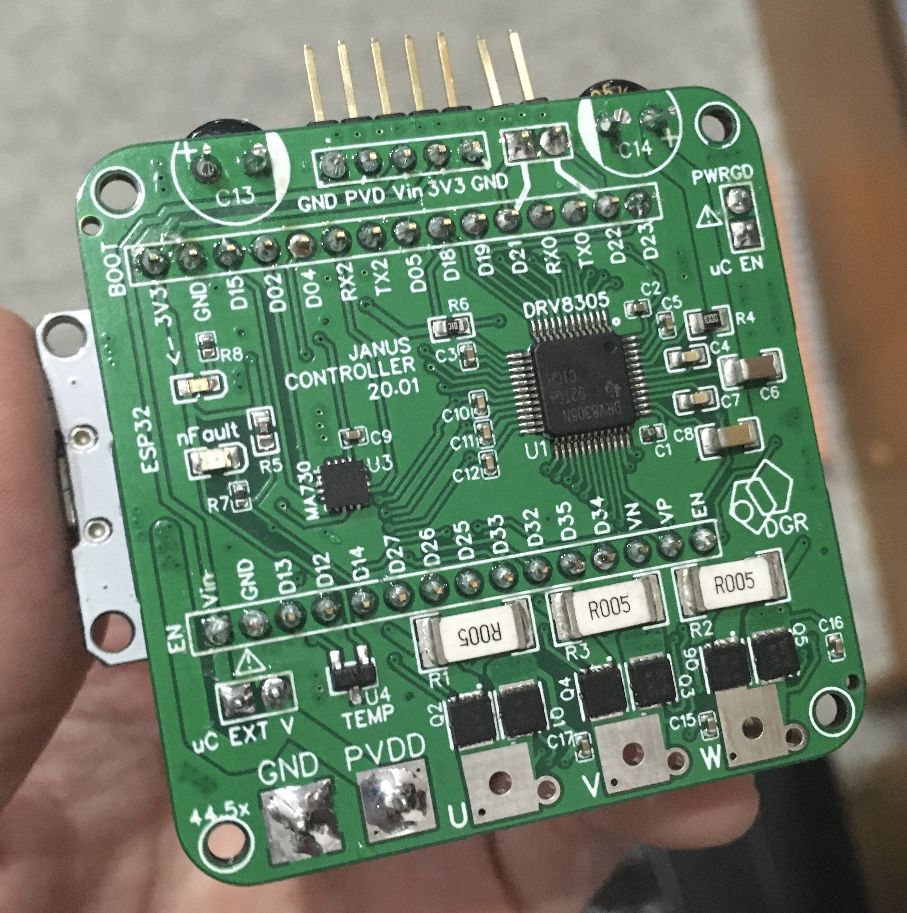

# Janus-Controller

The Janus Controller is a Brushless motor driver with an onboard magnetic encoder, a three-phase MOSFET driver, three MOSFET half-bridges, a temperature sensor and current sensing resistors. 
This board was designed to control de position and velocity of brushless motors. 

Janus Controller was designed to work with ESP32 Dev-Kit1 as a shield so that the programing of the board is easier for hobbyist and students and the overall price of the board is smaller. I'm working on a version with an onboard microcontroller. 
This board can be used to drive brushless motors as an open-loop system or use the on-board encoder to drive the motors as a closed-loop system and use complicated algorithms, such as Field Oriented Control.
I recommed using the [Simple FOC](https://github.com/askuric/Arduino-FOC) arduino library as it has shown to work perfectly for position and velocity control and is easily implementable, but you can always use your own algorithm. My example code uses the Simple FOC library adapted to work with an ESP32.
