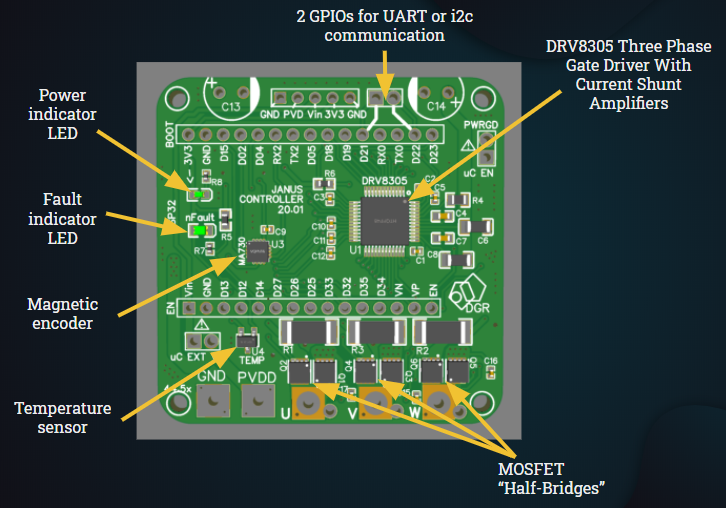
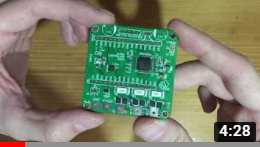
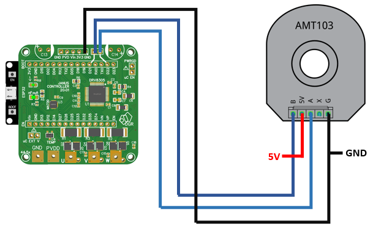
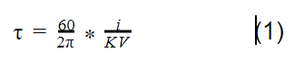
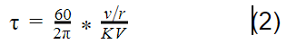
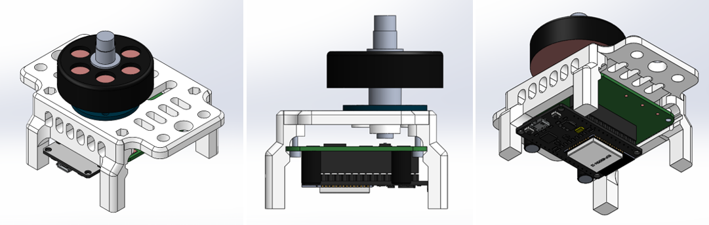

# Janus Controller 20.01

The Janus Controller is a Brushless motor driver with an on-board magnetic encoder, a three-phase MOSFET driver, three MOSFET half-bridges, a temperature sensor and current sensing resistors. 

Janus Controller was designed to work with the ESP32 Dev-Kit1 as a shield so that the programing of the board is easier for hobbyist and students, and to bring down the overall price of the board.
This board can be used to drive brushless motors as an open-loop system or use the on-board encoder to drive the motors as a closed-loop system and use more complicated algorithms, such as Field Oriented Control for position and velocity control.
I recommend using the [Simple FOC](https://github.com/askuric/Arduino-FOC) Arduino library as it has shown to work perfectly for position and velocity control and is easily implementable, but you can always use your own algorithm. My [example code](JC01F05/JC01F05.ino) uses the [Simple FOC](https://github.com/askuric/Arduino-FOC) library adapted to work with an ESP32.

## Key specs
| Specification    | Rating          |
| ------------- |:-------------:|
| Dimensions      | 51 x 51mm |
| Power source voltage      | 5-12V |
| Continuous current without cooling    | up to 5A |
| Continuous current with (great) cooling and 2oz PCB   | up to 23A |
| Encoder resolution | 4096 cpr/ 0.088 degrees |
| Temperature sensor range | -10 ~ 120°C |

## Getting started

### The board
In this repository you can find everything you need to get you started with your personal projects. The board was designed around the [JLCPCB SMT Parts Library](https://jlcpcb.com/parts), so you should be able to order an SMD assembled board directly from them for a low price. 
You can order this board from your preferred manufacturer, you just need to download the [gerber files](Gerber) and the [SMD BOM](BOM_JC20.01.csv). If you don't order your board from JLCPCB you should make sure that the manufacturer has in stock the needed SMD parts, if not it shouldn't be too difficult to find a replacement (except for the DRV8305 and the MA730).
Furthermore, if you wish to design your own board the [schematic](Schematic) can be a great place to start.  

After receiving the SMD assembled board you need to solder two 470 uF electrolytic capacitors, a few male/ female pins and a voltage source connector. The pins and the connector are optional, but I highly recommend using female header pins for the ESP32 Dev-kit.
The video bellow shows what is needed to prepare the board and how to do it. Alternatively, you can find the needed components in the [*though-hole* BOM](BOM).

### ESP32 DEVKIT
As stated before, the Janus Controller was designed as a *shield* for the ESP32 DEVKIT V1. There are a few different ESP32 Devkits out there, make sure the one you buy has the same PIN layout as the Janus Controller.

## Set-up

### The three-phase gate driver
The DRV8305 is a three-phase gate driver that can drive high and low-side N-channel MOSFETS. What makes this driver special is the bunch of programable functions and the protection included.
With the Janus Controller you can use the DRV8305 in its three operation modes: 6-PWM input, 3-PWM input or 1-PWM input. The [example code](JC01F05/JC01F05.ino) works with the driver set through SPI to operate in the 3-PWM mode.
One feature I like is its fault diagnostics, if the nFault pin pulses it means there is a *warning* that can be read through SPI. If the pin is pulled low it means the driver detected a *fault*, which can also be read through SPI, and the output MOSFETs will be placed in their high impedance state.
The Janus Controller board has a red indicator LED that will turn on if a *warning* or a *fault* is detected.
A few of the faults that the driver reports are the following: high temperature flags, source under or over-voltage, VDS over current monitors, gate drive fault, etc.
The picture bellow shows the simplified schematic of the driver that can be found in the [DRV8305 datasheet](https://www.ti.com/lit/ds/symlink/drv8305.pdf?ts=1593641896221&ref_url=https%253A%252F%252Fwww.google.com%252F). Please refer to it if you want to learn more about all the features of this driver IC.
 

### The on-board encoder
The MA730 Magnetic Encoder works with a diametrically polarized magnet, these can be hard to find but you should be able to find a couple options from eBay. 
The [MA730 datasheet](https://www.monolithicpower.com/en/documentview/productdocument/index/version/2/document_type/Datasheet/lang/en/sku/MA730/document_id/3563) recommends a Neodymium alloy (N35) cylinder with dimensions Ø5x3mm inserted into an aluminum shaft, as shown in the picture bellow, placed around 1.5mm above the encoder IC. 
You can use a solid cylindrical magnet of different dimensions without the aluminum shaft and still get excellent results.  

   
The Janus Controller can read the 12-bit ABZ quadrature pins of the encoder to find the position of the rotor. Additionally, a PWM signal can be read to find the absolute position of the rotor (this hasn't been implemented in example code at the moment). 

### External encoder
If you don't want to use the on-board encoder, Janus Controller has access to two GPIOs of the ESP32. These pins can be used to use an external quadrature encoder that should be conected as shown in the picture. Read your encoder's datasheet and check if it needs pull-ups, if so you should be able to use the ESP32's internal pull-ups.

## The example code
The example code was done in the Arduino IDE, running the [Simple FOC](https://github.com/askuric/Arduino-FOC) Arduino Library. By changing a simple parameter, this code allows you to control position and velocity of your burshless motor, or setting a voltage as you would do with a DC motor. 
Make sure you follow the following steps to make sure the code will compile.

### 1. ESP32 set-up
*Random nerd tutorials* have a really easy to follow guide on how to set-up the ESP32 on the Arduino IDE. Follow the steps on [this link](https://randomnerdtutorials.com/installing-the-esp32-board-in-arduino-ide-windows-instructions/) and make sure you can compile one of the examples shown.

### 2. Running the encoder example
Download the [Encoder Tester](JC01F05/JC01F05.ino) and open it on your Arduino IDE. Upload it to the ESP32 and open the Serial terminal and make sure the measurement is accurate. Move the motor's rotor one whole whole rotation and make sure the trerminal prints 360 degrees. 

### 3. Simple FOC library installation
The [Simple FOC](https://github.com/askuric/Arduino-FOC) repository has an extremely detailed explanation on how to install the library. The easiest way is to install it through the library manager as shown in the picture.  

Currently, the ESP32 isn't supported by the library just yet, if you need a stable version that works for the ESP32 send me a message.

### 4. Running the position control example
Download the [position control example code](JC01F05/JC01F05.ino) and open it on your Arduino IDE; there are a few parameters that you might have to tweak. I really recommend reading the [Simple FOC](https://github.com/askuric/Arduino-FOC) documentation. 

## Brushless motor selection
There are a few general rules that should help you choose the best brushless motor for your particular application. For instance, if you want to build a robot arm, a gimbal, or something that needs relative high torque you should get a low KV motor (usually bellow 300 is good) with a big radius in relation to its length. 
Usually, outrunner brushless motors have more poles than their counterpart, the inrunner, so they spin slower and produce more torque. This makes an outrunner the better choice for this type of application. 
We can use the torque equation of a brushless motor to calculate the ideal torque a motor will produce at a given voltage/ current. The value calculated with this formula will not be the real value because motors are far from ideal. I've found that considering a motor efficiency of around 80% should be good enough for estimating the maximum torque of a brushless motor.
  \
If you're not sure how much current the motor will draw you can substitute de current in the formula for voltage over the internal resistance of the motor, as show in the equation (2). 
If the internal resistance of the motor seems too low, there is a parameter in the [example code](JC01F05/JC01F05.ino) that restricts the voltage applied to the motor. Generally, a resistance of around 10 ohms should be perfect.  
  

## Test Station
The test station is a 3D printed base that holds together the Janus Controller board and a brushless motor with a diametrically polarized magnet. This magnet is attached to the rotor of the motor and placed above the magnetic encoder; around 1.5mm above the encoder is optimal, making sure the center of the magnet is aligned with the center of the encoder.
In the [CAD](CAD) section you can find the CAD for the Test Station, the Janus Controller board, the motor used, the magnet used and the ESP32 Dev-kit. The CAD of the Janus Controller should help you design your own fixture to hold the board near your motor. 

## Practical Example
Big J is a five-bar parallel robot that uses direct drive brushless motors as actuators working with two Janus Controllers in position control mode and a master ESP32. Click the image bellow to watch a demo YouTube video.

## Contact
I'm happy to hear from your projects and to help in any way possible!  
davidglzrys@gmail.com  
[Linkedin](https://www.linkedin.com/in/david-g-reyes/)  
[YouTube](https://www.youtube.com/channel/UC4gsPZan2T4v5LpJ5J_t7sQ/featured)
